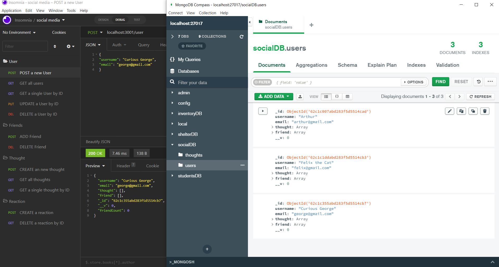
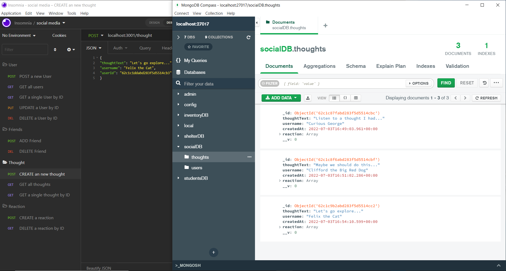

# NoSQL: Social Media API

## Description

Build and structure an back-end API for a social network using **Mongoose Object Data Modeling (ODM) for MongoDB** where users can share their thoughts, react to friends' thoughts, and create a friend list. MongoDB is used for large platforms because of its speed with large amounts of data and flexibility with unstructured data. Use Insomnia to check all API `GET`, `POST`, `PUT`, and `DELETE` routes. [format timestamps](https://mongoosejs.com/docs/timestamps.html). [Validation](https://mongoosejs.com/docs/validation.html)

## Installation
Be sure to have MongoDB installed on your machine. Follow the [MongoDB installation guide on The Full-Stack Blog](https://coding-boot-camp.github.io/full-stack/mongodb/how-to-install-mongodb) to install MongoDB locally.

Use Express.js for routing [Express.js](https://www.npmjs.com/package/express) 
```
npm install express
```

Mongo Database [Mongoose](https://www.npmjs.com/package/mongoose)
```
npm install mongoose
```

[To Install Insomnia](https://docs.insomnia.rest/insomnia/install) Insomnia is not installed as a CLI but it it a program used for opening API routes. 

## Usage

* Run `npm run dev` to have the server automatically restart whenever changes are saved using nodemon.

* Run `npm run start` or `node server.js` to launch the application into Mongo Compass. Mongo Compass will create the **socialDB** along with two collections **thoughts** and **users**.

* Through Insomnia, **users** data is created `POST/CREATE a new user` and will populate in the Mongo Compass user collection. Example entry below:
```
{
"username": "Clifford the Big Red Dog",  
"email": "clifford@gmail.com"
}
```

* Through Insomnia, **thought** data is created `POST/CREATE a new thought` and will populate in the Mongo Compass thought collection. Example entry below:
```
{ 
"thoughtText": "Let's go explore...",  
"username": "Felix the Cat",
"userId": "62c1c1ddabd283f5d5514cb3"
}
```
* Screenshots below indicate the Insomnia seeding the MongoDB.
* A walkthrough video was created in the link below to show the CRUD operations.

## Items Completed

✅ Enter the command to invoke the application to start the server so the Mongoose Models are synced to MongoDB.

✅ Open API `GET` routes Insomnia for **Users and Thoughts**. Then the data for each of these routes is diplayed in a formatted JSON.

✅ Test API `POST`, `PUT`, and `DELETE` routes Insomnia to show **Users and Thoughts** can be successfully created, updated, and deleted.

✅ Test API `POST` and `DELETE` routes Insomnia to show **Reactions to Thoughts** can be successfully created and deleted.

✅ Test API `POST` and `DELETE` routes Insomnia to show **Friends to a User's Friend List** can be successfully created and deleted.

## Walkthrough Videos: 

[Screencastify for Insomnia Demonstration](https://drive.google.com/file/d/10Lsk9vWGqvWa4DitwuNJvKZJ2qHZSJJS/view)

https://drive.google.com/file/d/10Lsk9vWGqvWa4DitwuNJvKZJ2qHZSJJS/view

## Screenshot



### Models

**User**:

* `username`
  * String
  * Unique
  * Required
  * Trimmed

* `email`
  * String
  * Required
  * Unique
  * Must match a valid email address (look into Mongoose's matching validation)

* `thoughts`
  * Array of `_id` values referencing the `Thought` model

* `friends`
  * Array of `_id` values referencing the `User` model (self-reference)

**Schema Settings**:

Create a virtual called `friendCount` that retrieves the length of the user's `friends` array field on query.

---

**Thought**:

* `thoughtText`
  * String
  * Required
  * Must be between 1 and 280 characters

* `createdAt`
  * Date
  * Set default value to the current timestamp
  * Use a getter method to format the timestamp on query

* `username` (The user that created this thought)
  * String
  * Required

* `reactions` (These are like replies)
  * Array of nested documents created with the `reactionSchema`

**Schema Settings**:

Create a virtual called `reactionCount` that retrieves the length of the thought's `reactions` array field on query.

---

**Reaction** (SCHEMA ONLY)

* `reactionId`
  * Use Mongoose's ObjectId data type
  * Default value is set to a new ObjectId

* `reactionBody`
  * String
  * Required
  * 280 character maximum

* `username`
  * String
  * Required

* `createdAt`
  * Date
  * Set default value to the current timestamp
  * Use a getter method to format the timestamp on query

**Schema Settings**:

This will not be a model, but rather will be used as the `reaction` field's subdocument schema in the `Thought` model.

### API Routes

**`/api/users`**
* `GET` all users
* `GET` a single user by its `_id` and populated thought and friend data
* `POST` a new user:
* `PUT` to update a user by its `_id`
* `DELETE` to remove user by its `_id`
**BONUS**: Remove a user's associated thoughts when deleted.

---

**`/api/users/:userId/friends/:friendId`**
* `POST` to add a new friend to a user's friend list
* `DELETE` to remove a friend from a user's friend list

---

**`/api/thoughts`**
* `GET` to get all thoughts
* `GET` to get a single thought by its `_id`
* `POST` to create a new thought (don't forget to push the created thought's `_id` to the associated user's `thoughts` array field)
* `PUT` to update a thought by its `_id`
* `DELETE` to remove a thought by its `_id`

---

**`/api/thoughts/:thoughtId/reactions`**
* `POST` to create a reaction stored in a single thought's `reactions` array field
* `DELETE` to pull and remove a reaction by the reaction's `reactionId` value
